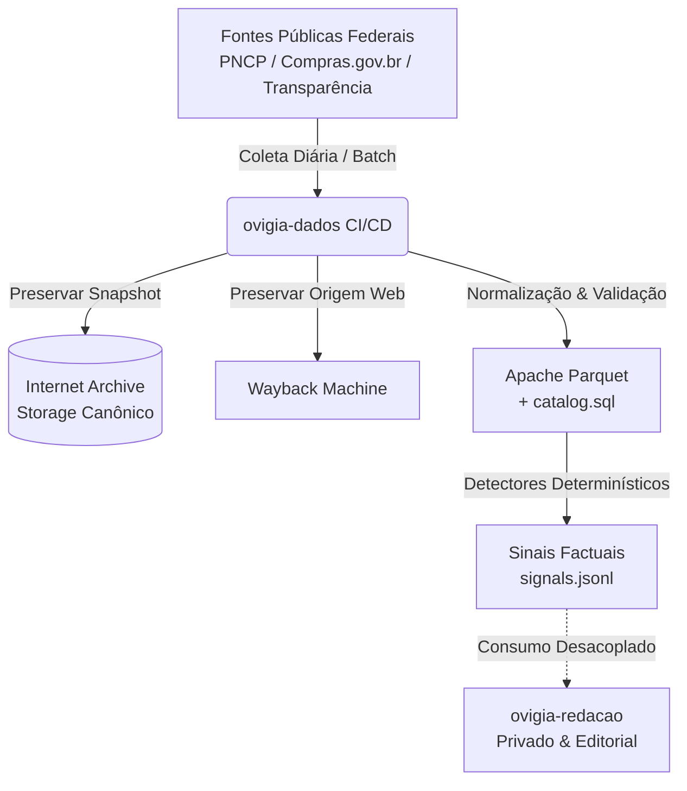

# Arquitetura do `ovigia-dados`

Este documento descreve as decisões arquiteturais, fluxos de dados e fronteiras de isolamento do projeto `ovigia-dados`.

---

## 1. Princípios de Separação de Responsabilidades

### 1.1 Fronteira Pública (`ovigia-dados`)
* **Código aberto e auditável**: Todos os scripts de coleta, transformação e detecção são públicos.
* **Storage canônico aberto**: Snapshots em Parquet, arquivos brutos e manifestos residem no Internet Archive sob licenças públicas de dados abertos.
* **Saída neutra e determinística**: Detectores emitem métricas matemáticas (percentis, rankings, comparativos temporais, novos fornecedores).

### 1.2 Fronteira Privada (`ovigia-redacao`)
* O repositório de Redação consome os artefatos e sinais gerados pelo `ovigia-dados`.
* Hipóteses jornalísticas, fontes humanas, pautas e drafts são mantidos estritamente privados.
* Nenhum token ou privilégio de escrita na Redação é exposto no repositório de dados.

---

## 2. Contrato de Distribuição de Dados

1. **Parquet como formato analítico primário**:
   * Tipagem estrita (DECIMAL para valores monetários ou DOUBLE estável, DATE/TIMESTAMP para datas ISO).
   * Sem compressões proprietárias; compatível com DuckDB, Polars, Pandas, Spark.
2. **`catalog.sql` como Contrato SQL DuckDB**:
   * Arquivo SQL puro contendo views sobre os endpoints HTTP do Internet Archive (`read_parquet('https://archive.org/download/...')`).
   * Permite que qualquer usuário ou ferramenta consulte os dados sem necessidade de download prévio completo ou binários `.duckdb` desatualizados.
3. **Manifesto e Rastreabilidade**:
   * Cada snapshot possui `manifest.json` com SHA-256 do arquivo bruto e do Parquet gerado, contagem de registros, URL de origem e timestamp de observação.

---

## 3. Estados de Execução de Pipelines

Ao rodar uma rotina diária de coleta, os seguintes estados de término são suportados e considerados sucessos normais:
* `no_source_change`: A fonte de dados foi consultada e não houve alteração desde o último snapshot.
* `snapshot_published`: Novo snapshot extraído, validado, convertido em Parquet e publicado no Internet Archive.
* `no_material_signal`: Detectores executados sobre o dataset e nenhum registro superou os limiares de excepcionalidade configurados.
* `signals_emitted`: Sinais factuais gerados e gravados em `signals.jsonl` / `signals.parquet`.
* `source_blocked`: A fonte governamental retornou erro transiente ou bloqueio de rede (registrado para re-tentativa sem quebrar o pipeline).
